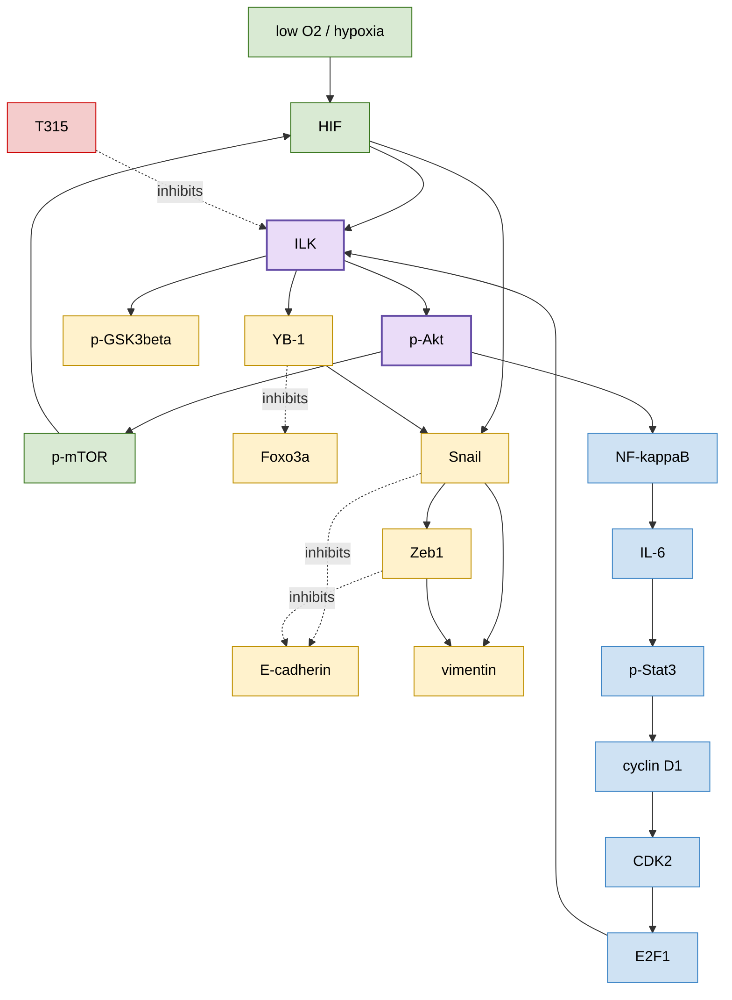

# Pathway overview for model expansion

```mermaid
flowchart TB
    %% Gilin et al. core
    O2["low O2 / hypoxia"] --> HIF["HIF"]
    HIF --> ILK["ILK"]
    ILK --> pAkt["p-Akt"]
    pAkt --> pmTOR["p-mTOR"]
    pmTOR --> HIF

    %% Chou et al. extension
    ILK --> pGSK3["p-GSK3beta"]
    ILK --> YB1["YB-1"]
    YB1 -.->|inhibits| Foxo3a["Foxo3a"]
    HIF --> Snail["Snail"]
    YB1 --> Snail
    Snail --> Zeb1["Zeb1"]
    Snail -.->|inhibits| Ecad["E-cadherin"]
    Zeb1 -.->|inhibits| Ecad
    Snail --> Vim["vimentin"]
    Zeb1 --> Vim
    T315["T315"] -.->|inhibits| ILK

    %% Hsu et al. extension
    IL6["IL-6"] --> pStat3["p-Stat3"]
    pStat3 --> CyclinD1["cyclin D1"]
    CyclinD1 --> CDK2["CDK2"]
    CDK2 --> E2F1["E2F1"]
    E2F1 --> ILK
    pAkt --> NFkB["NF-kappaB"]
    NFkB --> IL6

    %% Styling
    classDef gilin fill:#d9ead3,stroke:#38761d,stroke-width:1px,color:#000;
    classDef chou fill:#fff2cc,stroke:#bf9000,stroke-width:1px,color:#000;
    classDef hsu fill:#cfe2f3,stroke:#3d85c6,stroke-width:1px,color:#000;
    classDef inhibitor fill:#f4cccc,stroke:#cc0000,stroke-width:1px,color:#000;
    classDef shared fill:#eadcf8,stroke:#674ea7,stroke-width:2px,color:#000;

    class O2,HIF,pmTOR gilin;
    class pGSK3,YB1,Foxo3a,Snail,Zeb1,Ecad,Vim chou;
    class IL6,pStat3,CyclinD1,CDK2,E2F1,NFkB hsu;
    class T315 inhibitor;
    class ILK,pAkt shared;
```